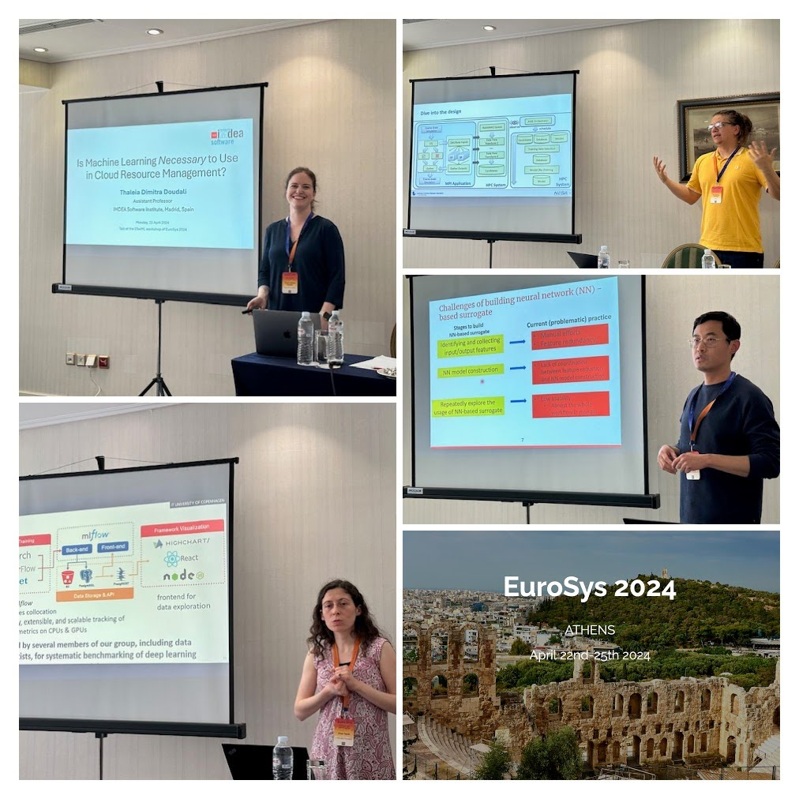

# Program

April 22nd, 2024

### Session 1

13:45 - 14:30 (incl. 10 min Q&A)

**Is Machine Learning Necessary to Use in Cloud Resource Management?** 
*Thaleia Dimitra Doudali, IMDEA Software Institute, Madrid, Spain*
[Slides](2024-ESwML-Thaleia.pdf)

 
14:30 - 15:15 (incl. 10 min Q&A)

**Towards Transparency in Computational Footprint of Deep Learning**
*Pinar Tözün, IT University of Copenhagen, Denmark*
[Slides](2024-ESwML-Pinar.pdf)

### Coffee Break (15:15 - 15:45)

### Session 2

15:45 - 16:30 (incl. 10 min Q&A)

**Challenges and Automation When Using Machine Learning Surrogates in Scientific Applications**
*Konstantinos Parasyris, Lawrence Livermore National Laboratory, USA*
[Slides](2024-ESwML-Dinos.pptx)

16:30 - 17:15 (incl. 10 min Q&A)

**Auto-HPCnet: an Automatic Framework to Build Neural Network-based Surrogate for HPC Applications**
*Dong Li, University of California, Merced, CA USA* 
[Slides](2024-ESwML_auto-hpcnet.pdf)

# Workshop Co-chairs
- Florina Ciorba (University of Basel, Switzerland), florina.ciorba at unibas.ch
- Harshitha Menon (Lawrence Livermore National Laboratory, USA), harshitha at llnl.gov
- Konstantinos Parasyris (Lawrence Livermore National Laboratory, USA) parasyris1 at llnl.gov

# Registration
Attendance at this workshop is part of the registration for Eurosys 2024. See [here](http://2024.eurosys.org/) to register.

# Topics of Interest
Topics of interest to the ML4SW workshop include but are not limited to:
- Machine learning techniques to improve programming productivity
- Applications performance analysis driven by AI and ML
- Software or Application  debugging and testing driven by AI and ML
- Automatic Differentiation and Error propagation in existing applications.
- AI-assisted code recommendations for code documentation, maintainability, performance improvement and correctness
- Performance data collection, labeling and storage for ML training.
- Application data collection and storage for supervised surrogate model learning.
- Continuous Learning of application and system performance.
- Transfer Learning across applications and systems

# Important Deadlines
Submission due date: February 15, 2025 (AoE)

Author notification: March 8, 2025

Camera-ready papers: March 13, 2025

# Submission

**Full papers** may not exceed 8 single-spaced double-column pages.

Papers must be submitted through HotCRP: https://eswml24.hotcrp.com/

---
---
