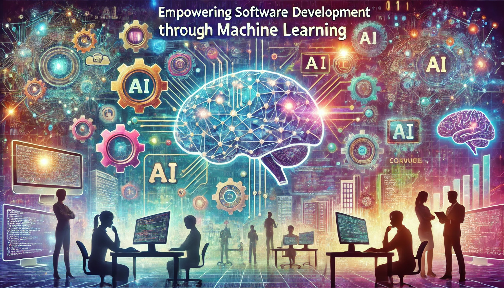

<!DOCTYPE html>
<html lang="en">
<head>
    <meta charset="UTF-8">
    <meta name="viewport" content="width=device-width, initial-scale=1.0">
    <title>Centered Title with Markdown Reset</title>
    
</head>
<body>
    <h1 class="title">The Second International Workshop on Empowering Software Development through Machine Learning</h1>
    

        Rotterdam, Netherlands, Monday 31 March Co-located with <a href="https://www.asplos-conference.org/asplos2025/workshops-and-tutorials/#schedule" target="_blank">EuroSys/ASPLOS</a>
    

    <!-- Container for markdown content -->
    

        <!-- Markdown content will render here -->
        <!-- GitHub Pages will render this correctly when Markdown is processed -->
        <!-- Markdown content starts below the HTML -->
    

</body>
</html>

*An image generated by ChatGPT-4o when promted to generated an image for a workshop with the [Overview](https://eswml.github.io/) description.*

# Call For Participation 

The software of tomorrow will heavily rely on the use of machine learning models. This will span various aspects including using Machine Learning (ML) models during software  development time to enhance developer productivity, designing ML heuristics to improve application execution, and adopting surrogate Neural Networks (NN) models within applications to replace expensive computations and accelerate their performance. However, several challenges limit the broad adoption of ML in today’s software. The goal of Empowering Software Development through Machine Learning (ESwML) half-day workshop is to establish a platform where researchers, scientists, application developers, computing center staff, and industry professionals can come together to exchange ideas and explore how artificial intelligence can help in effective and efficient use of future systems.

This workshop will actively drive discussion and aim to
answer the following questions:

**This workshop will actively drive discussion and aim to answer the following questions:**	
 - How can we leverage the advances in Machine Learning to ease the software development process?
 - What tools are missing to bridge the interaction with ML models during application development?
 - Can we improve the accuracy and efficiency of ML models by exposing to them existing analytical tools? For example, enabling Large Language Models to interact with memory sanitizers etc.
 - How can we seamlessly integrate ML models into applications to improve their performance while ensuring the correctness of the generated outputs? 

## Paper and abstract submission
**We seek abstracts describing recent or ongoing research related to the research topics in the  ESwML workshop. All researchers and practitioners are welcome to submit their work for presentation at this workshop. This is an in-person workshop and only the slides will optionally be posted on the workshop website.**

Short papers must be submitted electronically as PDF files. Format is  1-4 double-column pagesexcluding references.
Submissions should be printable on US Letter or A4 paper. Please submit your manuscripts through hotcrp: *To be announced*. 

**Note:** Presentations and short papers will be made available online only with the explicit consent of the authors. Authors who wish to share their presentations are encouraged to inform the workshop organizers.

# Important Deadlines
**Submission due date:** February 7, 2025 (AoE)
**Author notification:** February 21, 2025
**Workshop scheduled date:** March 31, 2025

# Workshop Co-chairs
- Florina Ciorba (University of Basel, Switzerland), florina.ciorba at unibas.ch
- Harshitha Menon (Lawrence Livermore National Laboratory, USA), harshitha at llnl.gov
- Konstantinos Parasyris (Lawrence Livermore National Laboratory, USA) parasyris1 at llnl.gov

---
---
