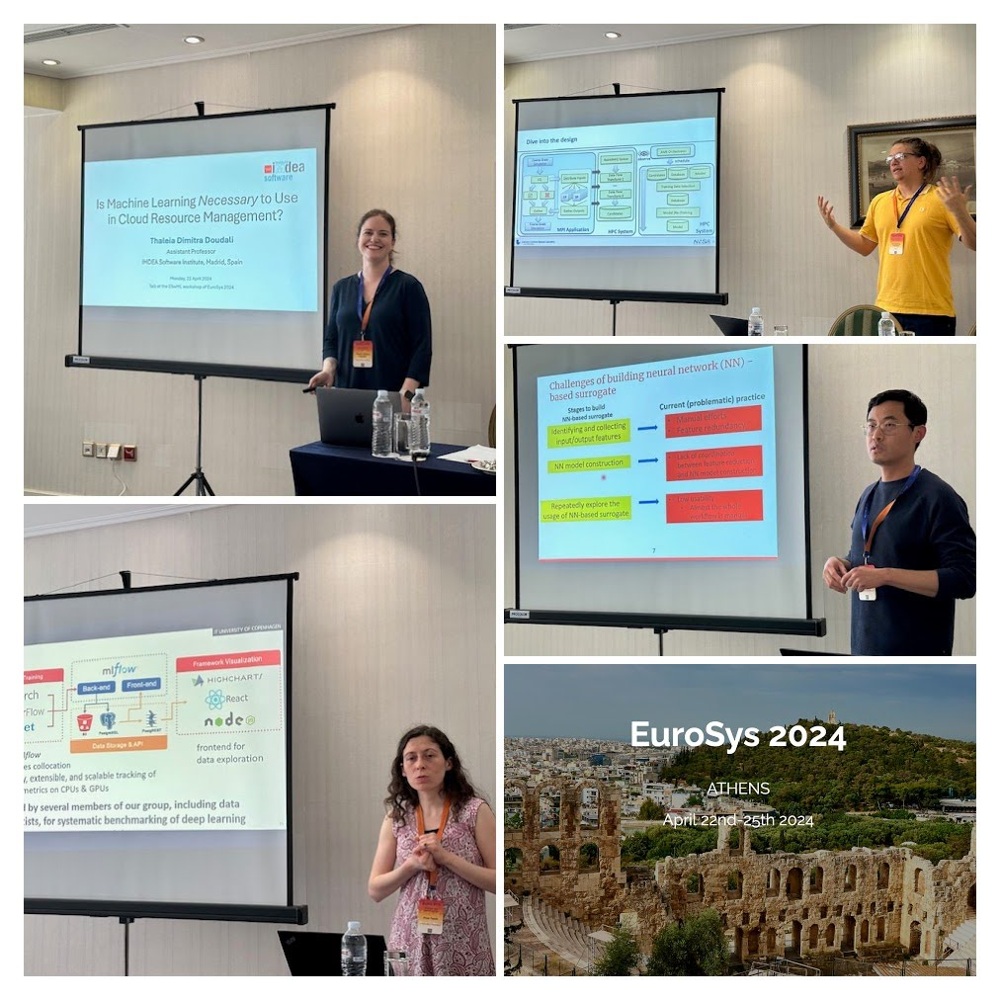

# Empowering Software through Machine Learning (ESwML)

# Overview

The software of tomorrow will heavily rely on the use of machine learning models. This will span various aspects including using Machine Learning (ML) models during the development time to enhance developer productivity, designing ML heuristics to improve application execution, and adopting surrogate Neural Networks (NN) models within applications to replace expensive computations and accelerate their performance. However, several challenges limit the broad adoption of ML in today's software.

For example, there are no programming language extensions that can capture the developer’s intent to use surrogate NN models in their applications, nor can task scheduling algorithms communicate seamlessly with ML heuristics to decide and schedule tasks.  As applications continue to get integrated into complex, deep software stacks with workflows, compilers, runtime libraries, and heterogeneous systems, it becomes necessary to use novel techniques for assisting software development, supporting the application execution orchestration, and potentially improving application performance.

The goal of Empowering Software through Machine Learning (ESwML) workshop is to establish a platform where researchers, scientists, application developers, computing center staff, and industry professionals can come together to exchange ideas and explore how artificial intelligence can help in effective and efficient use of future systems.

This workshop will actively drive discussion and aim to answer the following questions:
- How can we leverage the advances in Machine Learning to ease the software development process?
- How can ML be applied to automate heuristic design? These heuristics play a crucial role in: compile-time performance prediction, scheduling policies adopted by datacenters, cloud communities, and HPC programming models.
- How can we seamlessly integrate ML models into applications to improve their performance while ensuring the correctness of  the generated outputs?

---
<!---
# Program

<figure>
 

  
 

</figure>

April 22nd, 2024

### Session 1

13:45 - 14:30 (incl. 10 min Q&A)

**Is Machine Learning Necessary to Use in Cloud Resource Management?** \
Thaleia Dimitra Doudali, IMDEA Software Institute, Madrid, Spain \
<a href='2024-ESwML-Thaleia.pdf'>[Slides]</a>

 
14:30 - 15:15 (incl. 10 min Q&A)

**Towards Transparency in Computational Footprint of Deep Learning** \
Pinar Tözün, IT University of Copenhagen, Denmark \
<a href='2024-ESwML-Pinar.pdf'>[Slides]</a>

### Coffee Break (15:15 - 15:45)

### Session 2

15:45 - 16:30 (incl. 10 min Q&A)

**Challenges and Automation When Using Machine Learning Surrogates in Scientific Applications** \
Konstantinos Parasyris, Lawrence Livermore National Laboratory, USA \
<a href='2024-ESwML-Dinos.pptx'>[Slides]</a>

16:30 - 17:15 (incl. 10 min Q&A)

**Auto-HPCnet: an Automatic Framework to Build Neural Network-based Surrogate for HPC Applications** \
Dong Li, University of California, Merced, CA USA \
<a href='2024-ESwML_auto-hpcnet.pdf'>[Slides]</a>
-->
---
# Committees

## Workshop Co-chairs
- Florina Ciorba (University of Basel, Switzerland), florina.ciorba at unibas.ch
- Harshitha Menon (Lawrence Livermore National Laboratory, USA), harshitha at llnl.gov
- Konstantinos Parasyris (Lawrence Livermore National Laboratory, USA) parasyris1 at llnl.gov

<!---
## Program Committee (To Be Confirmed)
- Chris Cummins (Meta, USA, Research Software Engineer) 
- Pavlos Petoumenos (University Of Manchester, UK, Assistant Professor)
- EunJung Park (Qualcomm, USA, Compiler Engineer) 
- Boyana Norris (University of Oregon, USA, Associate Professor)
- Riyadh Baghdadi (MIT, USA, Research Affiliate)
- Justin Gottschlich (Merly AI, USA, Chief Scientist)
- Tarindu Jayatilaka (Purdue University, USA, PhD Student)
- Xipeng Shen (North Carolina State University, USA,  Professor)
- Hugh Leather (University of Edinburgh, UK, Researcher)
- Keren Zhou (George Mason University, USA, Assistant Professor)
- Hui Guan (University of Massachusetts Amherst, USA, Assistant Professor)
- Daya Guo (University at Sun Yat-Sen, China, Phd Student)
- Nikhil Jain (NVIDIA, USA,  Senior Architect)
- Miltiadis Alamanis (Microsoft, USA, Research Scientist)
- Vasilis Vasiliadis (IBM, Ireland, Research Scientis)
- Giorgis Georgakoudis (LLNL, USA, Computer Scientist)
- Keita Teranishi (ORNL, USA, Senior Scientist)
- Thaleia Dimitra Doudali (IMDEA Software, Spain, Assistant professor)
- Albert Njoroge Kahira (Jülich Supercomputing Centre, Germany, Research Scientist)
- Paul M Carpenter (BSC, Spain, Senior Research Scientist)
-->
---

# Registration
Attendance at this workshop is part of the registration for Eurosys 2024. See [here](http://2024.eurosys.org/) to register.

# Topics of Interest
Topics of interest to the ML4SW workshop include but are not limited to:
- Machine learning techniques to improve programming productivity
- Applications performance analysis driven by AI and ML
- Software or Application  debugging and testing driven by AI and ML
- Automatic Differentiation and Error propagation in existing applications.
- AI-assisted code recommendations for code documentation, maintainability, performance improvement and correctness
- Performance data collection, labeling and storage for ML training.
- Application data collection and storage for supervised surrogate model learning.
- Continuous Learning of application and system performance.
- Transfer Learning across applications and systems

# Important Deadlines
Submission due date: February 15, 2025 (AoE)

Author notification: March 8, 2025

Camera-ready papers: March 13, 2025

# Submission

**Full papers** may not exceed 8 single-spaced double-column pages.

Papers must be submitted through HotCRP: https://eswml24.hotcrp.com/

---
---
